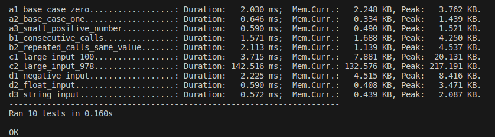

# goit-pycore-hw-05
*Repository for storing solutions to algorithmic homework assignments for GoIT Python Course, Homework 05.*
***

[🇺🇦 *Українська версія*](#uk)
<span id="en"></span>

## Table of Contents

1. [***"Caching Fibonacci Sequence Values"***](#task-1)
2. [***"Text Analysis and Total Income Calculation"***](#task-2)
3. [***"Log File Analysis Script"***](#task-3)
4. [***"Improve the Console Assistant Bot with Error Handling Using Decorators"***](#task-4)

---

### Task 1

**Caching Fibonacci Sequence Values**

#### Task Description
Create a function `caching_fibonacci` that uses a closure to efficiently compute values of the Fibonacci sequence using a cache.

#### Implementation Details
- The `caching_fibonacci` function should create and return an inner function `fibonacci(n)`.
- The `fibonacci(n)` function:
  - Must compute and return the `n`-th Fibonacci number.
  - If the number is already stored in the cache, it should return the value from the cache.
  - If the number is not in the cache, it should compute it, save it in the cache, and return the result.
- Use recursion to compute the sequence values.

#### Algorithm
1. Initialize an empty dictionary `cache`.
2. Implement the function `fibonacci(n)`:
   - If `n <= 0`, return 0.
   - If `n == 1`, return 1.
   - Check if the value for `n` is saved in the `cache`. If so, return `cache[n]`.
   - Compute `fibonacci(n - 1) + fibonacci(n - 2)`, save the result in the `cache`, and return it.
3. The `caching_fibonacci` function returns `fibonacci`.

#### Example Usage
```python
# Get the fibonacci function
fib = caching_fibonacci()

# Use the fibonacci function to calculate Fibonacci values
print(fib(10))  # Outputs 55
print(fib(15))  # Outputs 610
```

#### Features of [this implementation](https://github.com/andriy-pro/goit-pycore-hw-05/blob/main/src/caching_fibonacci.py)
In addition to fulfilling the main requirements of the assignment, a set of tests based on the `unittest` framework was created (located in the `tests/test_caching_fibonacci.py` file), which check:
- basic cases (0 and 1),
- small positive values,
- sequential calls for different values,
- repeated calls for the same value,
- large values of n (up to 978),
- handling of incorrect input data (negative numbers, floating-point numbers, strings).

Furthermore, the tests measure performance and output results, allowing for an assessment of the implementation's efficiency. A `measure_performance` decorator was created to measure execution time and memory usage. After running the tests in the terminal, messages are automatically sorted alphabetically, which was used to display results in the desired order (by naming the tests accordingly, while adhering to accepted standards).
Example of test results output in the terminal:



**Note**:
Upon initial attempts to run the test file `./tests/test_caching_fibonacci.py` in the terminal, it was found that Python could not locate the function being tested (file `./src/caching_fibonacci.py`). Meanwhile, the standard "VS Code" test run option (the "Run Tests" context menu item for the corresponding folder) executed without errors.
Creating a `__init__.py` file to help Python recognize the `src` folder as a module did not yield the desired result.
Among the possible solutions were:
1. Creating a `.env` file with environment variables and appropriately editing the "VS Code" configuration (`.vscode/settings.json`).
2. Adding the path to `test_caching_fibonacci.py` to the `PYTHONPATH` variable (for example, in Linux: `export PYTHONPATH="${PYTHONPATH}:/path/to/project_root"`; in Windows: `set PYTHONPATH=%PYTHONPATH%;C:\path\to\project_root`).
3. Additional parameters for running the test file, or using `unittest` from the command line (for example: `cd /path/to/project_root && python -m unittest discover -s tests`).

However, for this particular case, I chose the most universal method — adding the path to `sys.path` directly in the `test_caching_fibonacci.py` file:
```python
import sys
import os

sys.path.append(os.path.abspath(os.path.join(os.path.dirname(__file__), '..')))
```

[🇺🇦 *Прочитати це солов'їною*](#завдання-1) | [*Return to Table of Contents* 🔙](#en)

---

### Task 2

**Text Analysis and Total Income Calculation**

#### Task Description
Create a function `generator_numbers` that analyzes a text, identifies all valid numbers considered parts of income, and returns them as a generator. Valid numbers in the text are recorded without errors and clearly separated by spaces on both sides. Additionally, implement a function `sum_profit` that uses `generator_numbers` to sum these numbers and calculate the total profit.

#### Task Requirements

- The function `generator_numbers(text: str)` should accept a string as an argument and return a generator that iterates over all valid numbers in the text. Valid numbers in the text are considered to be recorded without errors and clearly separated by spaces on both sides.
- The function `sum_profit(text: str, func: Callable)` should use the `generator_numbers` generator to calculate the total sum of the numbers in the input string and accept it as an argument when called.

#### Recommendations for Implementation

- Use regular expressions to identify valid numbers in the text, considering that the numbers are clearly separated by spaces.
- Use the `yield` statement in the `generator_numbers` function to create the generator.
- Ensure that `sum_profit` correctly processes data from `generator_numbers` and sums all the numbers.

#### Evaluation Criteria

- Correct identification and return of valid numbers by the `generator_numbers` function.
- Correct calculation of the total sum in `sum_profit`.
- Code cleanliness, presence of comments, and adherence to PEP8 coding style.

#### Usage Example

```python
text = "The total income of the employee consists of several parts: 1000.01 as the main income, supplemented by additional receipts of 27.45 and 324.00 dollars."
total_income = sum_profit(text, generator_numbers)
print(f"Total income: {total_income}")
```

Expected Output:

```
Total income: 1351.46
```

#### Features of [this implementation](https://github.com/andriy-pro/goit-pycore-hw-05/blob/main/src/generator_numbers.py)

- **Flexibility in recognizing numbers**:
  Since the task does not specify that real numbers must be represented only with a dot, it was assumed that a real number can be:
    - with a dot;
    - with a comma;
    - without a dot or comma.

- **Use of regular expression**:
  The regular expression `" \d+(?:[.,]\d+)? "` was developed to recognize numbers in different formats:
    - `\d+` - matches one or more digits (at least one digit is required).
    - `(?:[.,]\d+)?` - an optional group that matches:
      - `[.,]` - either a dot or a comma;
      - `\d+` - one or more digits (at least one digit after the dot/comma);
      - `?` - makes this group optional.

- **Compilation of the regular expression for improved performance**:
  The regular expression is compiled before use:
  `pattern = re.compile(r'\d+(?:[.,]\d+)?')`.

- **Efficient use of iterator**:
  An iterator (`for match in pattern.finditer(text)`) is used to find numbers, which can be more efficient for large texts compared to finding all matches at once (e.g., using `pattern.findall(text)`, which returns a list).

- **Correct handling of numbers with commas**:
  Since `float()` cannot process numbers with commas, commas are replaced with dots: `.replace(',', '.')`.

- **Efficient use of memory**:
  Converting the found numbers to `float` occurs directly during iteration, which reduces additional memory usage.


[🇺🇦 *Прочитати це солов'їною*](#завдання-2) | [*Return to Table of Contents* 🔙](#en)

---

### Task 3

**Log File Analysis Script**

#### Task Description
Develop a Python script for analyzing log files. The script should read a log file passed as a command-line argument and output statistics by logging levels (e.g., INFO, ERROR, DEBUG). Users can also specify a logging level as a second command-line argument to get all entries of that level.

#### Task Requirements

1. The script should accept the path to the log file as a command-line argument.
2. The script should accept an optional command-line argument specifying the logging level. For example, the argument `error` will output all entries of the ERROR level from the log file.
3. The script should read and analyze the log file, counting the number of entries for each logging level (INFO, ERROR, DEBUG, WARNING).
4. Implement the function `parse_log_line(line: str) -> dict` to parse log lines.
5. Implement the function `load_logs(file_path: str) -> list` to load logs from the file.
6. Implement the function `filter_logs_by_level(logs: list, level: str) -> list` to filter logs by level.
7. Implement the function `count_logs_by_level(logs: list) -> dict` to count entries by logging level.
8. Implement the function `display_log_counts(counts: dict)`, which formats and outputs the results.

#### Example Log File

```
2024-01-22 08:30:01 INFO User logged in successfully.
2024-01-22 08:45:23 DEBUG Attempting to connect to the database.
2024-01-22 09:00:45 ERROR Database connection failed.
2024-01-22 09:15:10 INFO Data export completed.
2024-01-22 10:30:55 WARNING Disk usage above 80%.
2024-01-22 11:05:00 DEBUG Starting data backup process.
2024-01-22 11:30:15 ERROR Backup process failed.
2024-01-22 12:00:00 INFO User logged out.
2024-01-22 12:45:05 DEBUG Checking system health.
2024-01-22 13:30:30 INFO Scheduled maintenance.
```

#### Recommendations for Implementation

- Familiarize yourself with the structure of the log file. Note the format of the date and time, logging levels (INFO, ERROR, DEBUG, WARNING), and the structure of messages.
- Understand how different log components are separated (spaces or special characters).
- Break the task into logical blocks and functions for better readability and future expansion.
- Log line parsing is performed by the `parse_log_line(line: str) -> dict` function, which takes a log line as input and returns a dictionary with parsed components: date, time, level, message. Use string methods like `split()` to split the line into parts.
- Log file loading is performed by the `load_logs(file_path: str) -> list` function, which opens the file, reads each line, and applies `parse_log_line` to it, storing the results in a list.
- Filtering by logging level is performed by the `filter_logs_by_level(logs: list, level: str) -> list` function, which allows obtaining all log entries for a specific logging level.
- Counting entries by logging level is performed by the `count_logs_by_level(logs: list) -> dict` function, which iterates over all entries and counts the number of entries for each logging level.
- The `display_log_counts(counts: dict)` function formats and outputs the counting results in a readable form.
- The script should handle various types of errors, such as the absence of the file or errors in reading it. Use `try/except` blocks for handling exceptional situations.

#### Evaluation Criteria

- The script meets all specified requirements, correctly analyzing log files and outputting information.
- The script correctly handles errors, such as incorrect log file format or missing file.
- Uses one of the functional programming elements: lambda function, list comprehension, `filter` function, etc.
- The code is well-structured, clear, and contains comments where necessary.

#### Usage Example

When running the script:

```
python main.py /path/to/logfile.log
```

Expected output:

```
Logging Level | Count
--------------|------
INFO          | 4
DEBUG         | 3
ERROR         | 2
WARNING       | 1
```

If the user wants to view all entries of a specific logging level, they can run the script with an additional argument, for example:

```
python main.py /path/to/logfile.log error
```

This will output the overall statistics by levels, as well as detailed information for all entries of the ERROR level:

```
Logging Level | Count
--------------|------
INFO          | 4
DEBUG         | 3
ERROR         | 2
WARNING       | 1

Log details for level 'ERROR':
2024-01-22 09:00:45 - Database connection failed.
2024-01-22 11:30:15 - Backup process failed.
```

#### Features of [this implementation](https://github.com/andriy-pro/goit-pycore-hw-05/blob/main/src/log_analyzer.py)

- **Flexibility in configuring log levels**: Easily change the number of log levels by using the `LOG_LEVELS` variable (default values: `INFO`, `ERROR`, `DEBUG`, `WARNING`).
- **Informative error messages**: The `error_message` function provides unified messages that include error descriptions, details, and the expected string format.
- **Robustness against format errors**: The script continues to process logs even when incorrect lines are detected—incorrect log lines are skipped (with an appropriate message output), and processing continues.
- **Enhanced error handling**: The system handles various types of errors, including incorrect log levels and date-time formats.
- **Warnings for incorrect log levels**: A warning is displayed if an incorrect log level is specified, and this level is ignored in subsequent processing.

**Note**:
To support list unpacking in 'Literal' for valid "level" values ('class LogEntry'), the script requires Python version 3.10 or higher.

[🇺🇦 *Прочитати це солов'їною*](#завдання-3) | [*Return to Table of Contents* 🔙](#en)

---

### Task 4

**Improve the Console Assistant Bot with Error Handling Using Decorators**

#### Task Requirements

1. All user input errors should be handled using the `input_error` decorator. This decorator returns messages to the user such as "Enter user name", "Give me name and phone please", etc.
2. The `input_error` decorator should handle exceptions that occur in handler functions: `KeyError`, `ValueError`, `IndexError`. When an exception occurs, the decorator returns the appropriate response to the user. The program execution does not stop.

#### Recommendations for Implementation

Example of the `input_error` decorator for handling a `ValueError`:

```python
def input_error(func):
    def inner(*args, **kwargs):
        try:
            return func(*args, **kwargs)
        except ValueError:
            return "Give me name and phone please."
    return inner
```

Example of using the decorator for the `add_contact` function:

```python
@input_error
def add_contact(args, contacts):
    name, phone = args
    contacts[name] = phone
    return "Contact added."
```

You need to add handlers for other commands (functions) and add handling of other types of exceptions in the decorator with appropriate error messages.

#### Evaluation Criteria

1. Presence of the `input_error` decorator that handles user input errors for all commands.
2. Handling of `KeyError`, `ValueError`, `IndexError` errors in functions using the `input_error` decorator.
3. Each command handling function has its own `input_error` decorator that handles the relevant errors and returns appropriate error messages.
4. Correct bot response to various commands and handling of input errors without terminating the program.

#### Usage Example

When running the script, the dialog with the bot should look as follows:

```
Enter a command: add
Enter the argument for the command
Enter a command: add Bob
Enter the argument for the command
Enter a command: add Jime 0501234356
Contact added.
Enter a command: phone
Enter the argument for the command
Enter a command: all
Jime: 0501234356 
Enter a command:
```

#### Features of [this implementation](https://github.com/andriy-pro/goit-pycore-hw-05)

[🇺🇦 *Прочитати це солов'їною*](#завдання-4) | [*Return to Table of Contents* 🔙](#en)


***
***


[🇬🇧 *English Version*](#en)
<span id="uk"></span>

## Зміст
1. [***"Кешування значень послідовності Фібоначчі"***](#завдання-1)
2. [***"Аналіз тексту та підрахунок загального доходу"***](#завдання-2)
3. [***"Скрипт аналізу лог-файлу"***](#завдання-3)
4. [***"Покращення консольного бота-помічника з обробкою помилок за допомогою декораторів"***](#завдання-4)
---

### Завдання 1

**Кешування значень послідовності Фібоначчі**

#### Опис завдання

Створити функцію `caching_fibonacci`, яка використовує замикання для ефективного обчислення значень послідовності Фібоначчі з використанням кешу.

#### Деталі реалізації
- Функція `caching_fibonacci` має створювати та повертати внутрішню функцію `fibonacci(n)`.
- Функція `fibonacci(n)`:
  - Повинна обчислити та повернути `n`-те число Фібоначчі.
  - Якщо число вже збережено у кеші, повертає значення з кешу.
  - Якщо число відсутнє у кеші, має обчислити його, зберегти в кеш та повернути результат.
- Використати рекурсію для обчислення значень послідовності.

#### Алгоритм
1. Ініціалізувати порожній словник `cache`.
2. Реалізувати функцію `fibonacci(n)`:
   - Якщо `n <= 0`, повернути 0.
   - Якщо `n == 1`, повернути 1.
   - Перевірити, чи збережено значення для `n` у `cache`. Якщо так, повернути `cache[n]`.
   - Обчислити `fibonacci(n - 1) + fibonacci(n - 2)`, зберегти результат у `cache`, та повернути його.
3. Функція `caching_fibonacci` повертає `fibonacci`.

#### Приклад використання
```python
# Отримати функцію fibonacci
fib = caching_fibonacci()

# Використати функцію fibonacci для обчислення значень Фібоначчі
print(fib(10))  # Виведе 55
print(fib(15))  # Виведе 610
```

#### Особливості [даної реалізації](https://github.com/andriy-pro/goit-pycore-hw-05/blob/main/src/caching_fibonacci.py)
Додатково до виконання основних вимог завдання, було створено набір тестів на основі фреймворку `unittest` (розміщених у файлі `tests/test_caching_fibonacci.py`), що перевіряють:
- базові випадки (0 та 1),
- малі додатні значення,
- послідовні виклики для різних значень,
- повторювані виклики для одного і того ж значення,
- великі значення n (до 978),
- обробку некоректних вхідних даних (негативні числа, числа з комою, рядки).

Крім того, тести додатково вимірюють продуктивність та виводять результати, що дозволяє оцінити ефективність реалізації. Для вимірювання продуктивності було створено декоратор `measure_performance`, що включає заміри часу виконання та використання пам'яті. Після виконання тестів у терміналі, повідомлення автоматично сортуються за алфавітом, що було використано для виведення результатів у бажаному порядку (надаючи тестам відповідних назв, при цьому дотримуючись прийнятих стандартів).
Приклад виведення у терміналі результатів тестів:


**Примітка**:
При перших спробах запустити у терміналі файл тестів `./tests/test_caching_fibonacci.py`, було з'ясовано, що Python не знаходить тестовану функцію (файл `./src/caching_fibonacci.py`). В той же час, стандартна опція "VS Code" запуску тестів (пункт "Run Tests" з контекстного меню відповідної теки) — виконувалась безпомилково.
Створення файлу `__init__.py`, щоб допомогти Python розпізнати теку `src` як модуль, бажаного результату не дало.
Серед можливих рішень також були:
1. Створення файлу `.env` зі змінними середовища та відповідне редагування конфігурації "VS Code" (`.vscode/settings.json`).
2. Внесення шляху до `test_caching_fibonacci.py` у змінну `PYTHONPATH` (до прикладу, у Linux: `export PYTHONPATH="${PYTHONPATH}:/path/to/project_root"`; у Windows: `set PYTHONPATH=%PYTHONPATH%;C:\path\to\project_root`).
3. Додаткові параметри запуску файлу тестів, або використання `unittest` з командного рядка (до прикладу: `cd /path/to/project_root && python -m unittest discover -s tests`).

Але саме для цього випадку я обрав максимально універсальний спосіб — додавання шляху до `sys.path` безпосередньо у файлі `test_caching_fibonacci.py`:
```python
import sys
import os

sys.path.append(os.path.abspath(os.path.join(os.path.dirname(__file__), '..')))
```

[🇬🇧 *Read this in English*](#task-1) | [*Повернутися до змісту* 🔙](#uk)

---

### Завдання 2

**Аналіз тексту та підрахунок загального доходу**

#### Опис завдання
Необхідно створити функцію `generator_numbers`, яка буде аналізувати текст, ідентифікувати всі дійсні числа, що вважаються частинами доходів, і повертати їх як генератор. Дійсні числа у тексті записані без помилок, чітко відокремлені пробілами з обох боків. Також потрібно реалізувати функцію `sum_profit`, яка буде використовувати `generator_numbers` для підсумовування цих чисел і обчислення загального прибутку.

#### Вимоги до завдання

- Функція `generator_numbers(text: str)` повинна приймати рядок як аргумент і повертати генератор, що ітерує по всіх дійсних числах у тексті. Дійсні числа у тексті вважаються записаними без помилок і чітко відокремлені пробілами з обох боків.
- Функція `sum_profit(text: str, func: Callable)` має використовувати генератор `generator_numbers` для обчислення загальної суми чисел у вхідному рядку та приймати його як аргумент при виклику.

#### Рекомендації для виконання

- Використовуйте регулярні вирази для ідентифікації дійсних чисел у тексті, з урахуванням, що числа чітко відокремлені пробілами.
- Застосуйте конструкцію `yield` у функції `generator_numbers` для створення генератора.
- Переконайтеся, що `sum_profit` коректно обробляє дані від `generator_numbers` і підсумовує всі числа.

#### Критерії оцінювання

- Правильність визначення та повернення дійсних чисел функцією `generator_numbers`.
- Коректність обчислення загальної суми в `sum_profit`.
- Чистота коду, наявність коментарів та відповідність стилю кодування PEP8.

#### Приклад використання

```python
text = "Загальний дохід працівника складається з декількох частин: 1000.01 як основний дохід, доповнений додатковими надходженнями 27.45 і 324.00 доларів."
total_income = sum_profit(text, generator_numbers)
print(f"Загальний дохід: {total_income}")
```

Очікуваний результат:

```
Загальний дохід: 1351.46
```

#### Особливості [даної реалізації](https://github.com/andriy-pro/goit-pycore-hw-05/blob/main/src/generator_numbers.py)

- **Гнучкість у розпізнаванні чисел**:
  Оскільки в завданні ніде не сказано, що дійсні числа мають бути тільки з крапкою, то було взято за основу, що дійсне число може бути:
    - з крапкою;
    - з комою;
    - без крапки або коми.

- **Використання регулярного виразу**:
  Регулярний вираз `" \d+(?:[.,]\d+)? "` було розроблено для розпізнавання чисел з різними форматами:
    - `\d+` - відповідає одній або більше цифрам (обов'язково принаймні одна цифра).
    - `(?:[.,]\d+)?` - необов'язкова група, яка відповідає:
      - `[.,]` - або крапці, або комі;
      - `\d+` - одній або більше цифрам (обов'язково принаймні одна цифра після крапки/коми);
      - `?` - робить цю групу необов'язковою.

- **Компіляція регулярного виразу для покращення продуктивності**:
  Регулярний вираз перед застосуванням компілюється:
  `pattern = re.compile(r'\d+(?:[.,]\d+)?')`.

- **Ефективне використання ітератора**:
  Для пошуку чисел використовується ітератор (`for match in pattern.finditer(text)`), що може бути більш ефективним для значних за об'ємом текстів у порівнянні з пошуком усіх збігів за раз (до прикладу, за допомогою `pattern.findall(text)`, що повертає список).

- **Коректна обробка чисел з комами**:
  Оскільки `float()` не може обробити числа з комами, відбувається завчасна заміна ком на крапки: `.replace(',', '.')`.

- **Ефективне використання пам'яті**:
  Перетворення знайдених чисел на `float` відбувається безпосередньо під час ітерації, що зменшує використання додаткової пам'яті.


[🇬🇧 *Read this in English*](#task-2) | [*Повернутися до змісту* 🔙](#uk)

---

### Завдання 3

**Скрипт аналізу лог-файлу**

Розробити Python-скрипт для аналізу файлів логів. Скрипт має читати лог-файл, переданий як аргумент командного рядка, і виводити статистику за рівнями логування (наприклад, INFO, ERROR, DEBUG). Також користувач може вказати рівень логування як другий аргумент командного рядка, щоб отримати всі записи цього рівня.

#### Вимоги до завдання

1. Скрипт повинен приймати шлях до файлу логів як аргумент командного рядка.
2. Скрипт повинен приймати необов'язковий аргумент командного рядка, що вказує рівень логування. Наприклад, аргумент `error` виведе всі записи рівня ERROR з файлу логів.
3. Скрипт має зчитувати і аналізувати лог-файл, підраховуючи кількість записів для кожного рівня логування (INFO, ERROR, DEBUG, WARNING).
4. Реалізувати функцію `parse_log_line(line: str) -> dict` для парсингу рядків логу.
5. Реалізувати функцію `load_logs(file_path: str) -> list` для завантаження логів з файлу.
6. Реалізувати функцію `filter_logs_by_level(logs: list, level: str) -> list` для фільтрації логів за рівнем.
7. Реалізувати функцію `count_logs_by_level(logs: list) -> dict` для підрахунку записів за рівнем логування.
8. Реалізувати функцію `display_log_counts(counts: dict)`, яка форматує та виводить результати.

#### Приклад лог-файлу

```
2024-01-22 08:30:01 INFO User logged in successfully.
2024-01-22 08:45:23 DEBUG Attempting to connect to the database.
2024-01-22 09:00:45 ERROR Database connection failed.
2024-01-22 09:15:10 INFO Data export completed.
2024-01-22 10:30:55 WARNING Disk usage above 80%.
2024-01-22 11:05:00 DEBUG Starting data backup process.
2024-01-22 11:30:15 ERROR Backup process failed.
2024-01-22 12:00:00 INFO User logged out.
2024-01-22 12:45:05 DEBUG Checking system health.
2024-01-22 13:30:30 INFO Scheduled maintenance.
```

#### Рекомендації для виконання

- Ознайомтеся зі структурою лог-файлу. Зверніть увагу на формат дати та часу, рівні логування (INFO, ERROR, DEBUG, WARNING) і структуру повідомлень.
- Зрозумійте, як розділені різні компоненти логу (пробіли або спеціальні символи).
- Розділіть завдання на логічні блоки і функції для кращої читабельності і подальшого розширення.
- Парсинг рядка логу виконує функція `parse_log_line(line: str) -> dict`, яка приймає рядок з логу як вхідний параметр і повертає словник з розібраними компонентами: дата, час, рівень, повідомлення. Використовуйте методи рядків, такі як `split()`, для розділення рядка на частини.
- Завантаження лог-файлів виконує функція `load_logs(file_path: str) -> list`, що відкриває файл, читає кожен рядок і застосовує на нього функцію `parse_log_line`, зберігаючи результати в список.
- Фільтрацію за рівнем логування виконує функція `filter_logs_by_level(logs: list, level: str) -> list`. Вона дозволяє отримати всі записи логу для певного рівня логування.
- Підрахунок записів за рівнем логування виконує функція `count_logs_by_level(logs: list) -> dict`, яка проходить по всіх записах і підраховує кількість записів для кожного рівня логування.
- Вивід результатів здійснює функція `display_log_counts(counts: dict)`, яка форматує та виводить результати підрахунку в читабельній формі.
- Скрипт повинен вміти обробляти різні види помилок, такі як відсутність файлу або помилки при його читанні. Використовуйте блоки `try/except` для обробки виняткових ситуацій.

#### Критерії оцінювання

- Скрипт виконує всі зазначені вимоги, правильно аналізуючи лог-файли та виводячи інформацію.
- Скрипт коректно обробляє помилки, такі як неправильний формат лог-файлу або відсутність файлу.
- Використано один з елементів функціонального програмування: лямбда-функція, списковий вираз, функція `filter`, тощо.
- Код добре структурований, зрозумілий і містить коментарі там, де це необхідно.

#### Приклад використання

При запуску скрипту:

```
python main.py /path/to/logfile.log
```

Очікуваний результат:

```
Рівень логування | Кількість
-----------------|----------
INFO             | 4
DEBUG            | 3
ERROR            | 2
WARNING          | 1
```

Якщо користувач хоче переглянути всі записи певного рівня логування, він може запустити скрипт з додатковим аргументом, наприклад:

```
python main.py /path/to/logfile.log error
```

Це виведе загальну статистику за рівнями, а також детальну інформацію для всіх записів з рівнем ERROR:

```
Рівень логування | Кількість
-----------------|----------
INFO             | 4
DEBUG            | 3
ERROR            | 2
WARNING          | 1

Деталі логів для рівня 'ERROR':
2024-01-22 09:00:45 - Database connection failed.
2024-01-22 11:30:15 - Backup process failed.
```

#### Особливості [даної реалізації](https://github.com/andriy-pro/goit-pycore-hw-05/blob/main/src/log_analyzer.py)

- **Гнучкість в налаштуванні рівнів логу**: Легко змінити кількість рівнів логу, завдяки використанню змінної `LOG_LEVELS` (усталене значення: `INFO`, `ERROR`, `DEBUG`, `WARNING`).
- **Інформативні повідомлення про помилки:** Функція `error_message` забезпечує уніфіковане повідомлення, що включають опис помилки, деталі та формат очікуваного рядка.
- **Стійкість до помилок у форматі:** Скрипт продовжує обробку логу навіть при виявленні некоректних рядків — некоректні рядки логів пропускаються (з виведенням відповідного повідомлення), обробка продовжується.
- **Розширена обробка помилок:** Система забезпечує обробку різних типів помилок, включаючи невірний рівень логу, формат дати і часу.
- **Попередження про невірний рівень логу:** Виводиться попередження, якщо вказано невірний рівень логу, і цей рівень не враховується при подальшій обробці.

**Зауваження**:
Для підтримки розпаковки списку у 'Literal' для допустимих значень "level" ('class LogEntry') скрипт потребує Python версії 3.10 або вище.

[🇬🇧 *Read this in English*](#task-3) | [*Повернутися до змісту* 🔙](#uk)

---

### Завдання 4

**Покращення консольного бота-помічника з обробкою помилок за допомогою декораторів**

Доробити консольного бота-помічника з попереднього домашнього завдання та додати обробку помилок за допомоги декораторів.

#### Вимоги до завдання

1. Всі помилки введення користувача повинні оброблятися за допомогою декоратора `input_error`. Цей декоратор повертає користувачеві повідомлення типу "Enter user name", "Give me name and phone please" тощо.
2. Декоратор `input_error` повинен обробляти винятки, що виникають у функціях-handler: `KeyError`, `ValueError`, `IndexError`. Коли виникає виняток, декоратор повертає відповідну відповідь користувачеві. Виконання програми при цьому не припиняється.

#### Рекомендації для виконання

Приклад декоратора `input_error` для обробки помилки `ValueError`:

```python
def input_error(func):
    def inner(*args, **kwargs):
        try:
            return func(*args, **kwargs)
        except ValueError:
            return "Give me name and phone please."
    return inner
```

Приклад використання декоратора для функції `add_contact`:

```python
@input_error
def add_contact(args, contacts):
    name, phone = args
    contacts[name] = phone
    return "Contact added."
```

Необхідно додати обробники до інших команд (функцій) та додати в декоратор обробку винятків інших типів з відповідними повідомленнями.

#### Критерії оцінювання

1. Наявність декоратора `input_error`, який обробляє помилки введення користувача для всіх команд.
2. Обробка помилок типу `KeyError`, `ValueError`, `IndexError` у функціях за допомогою декоратора `input_error`.
3. Кожна функція для обробки команд має власний декоратор `input_error`, який обробляє відповідні помилки і повертає відповідні повідомлення про помилку.
4. Коректна реакція бота на різні команди та обробка помилок введення без завершення програми.

#### Приклад використання

При запуску скрипту діалог з ботом повинен виглядати наступним чином:

```
Enter a command: add
Enter the argument for the command
Enter a command: add Bob
Enter the argument for the command
Enter a command: add Jime 0501234356
Contact added.
Enter a command: phone
Enter the argument for the command
Enter a command: all
Jime: 0501234356 
Enter a command:
```

#### Особливості [даної реалізації](https://github.com/andriy-pro/goit-pycore-hw-05)

[🇬🇧 *Read this in English*](#task-4) | [*Повернутися до змісту* 🔙](#uk)

